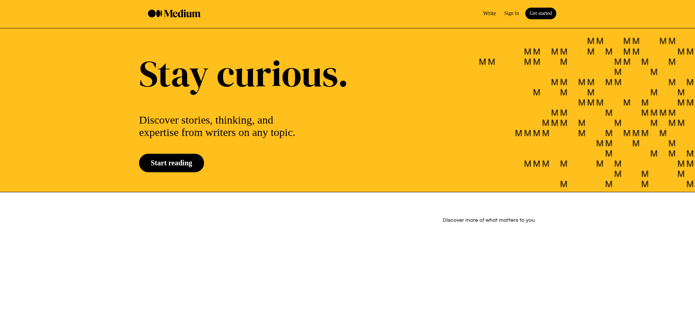
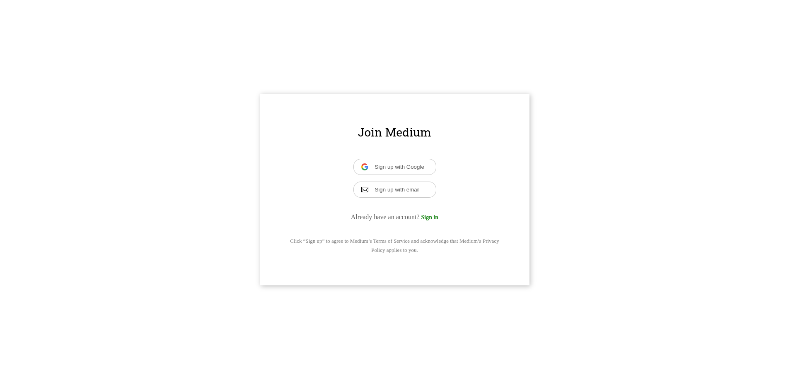

# 📰 Medium Clone — Full-Stack Blogging Platform  

A fully functional **Medium-inspired blogging application** built with **React (Vite)**, **Node.js**, **Express**, **TypeScript**, and **MongoDB**.  
It includes complete authentication, post creation, and commenting functionalities — all within a clean and responsive UI.

---

## 🚀 Tech Stack

- **Frontend:** React (Vite) + TypeScript  
- **Backend:** Node.js + Express + MongoDB  
- **Authentication:** JWT-based Auth  
- **Styling:** Tailwind / CSS Modules  
- **Dev Tools:** Docker (optional), Mongoose, Axios, React Query  

---

## 📸 Screenshots

| Home | Unauthenticated | Login | Post |
|------|------------------|-------|------|
|  |  |  |  |

---

## ⚙️ Prerequisites

Before starting, ensure you have the following installed:

- [**Git**](https://git-scm.com/downloads) – Version control system (usually preinstalled on macOS/Linux)  
- [**Node.js**](https://nodejs.org/en/download/) – Includes npm (Node package manager)

> 💡 **Verify installation:**
> ```bash
> git --version
> node -v
> npm -v
> ```

---

## 📦 Installation

### 1️⃣ Clone the repository

```bash
git clone https://github.com/nisabmohd/Medium-clone.git
cd Medium-clone

🧩 Environment Variables
🔹 Client (client/.env)

Create a .env file inside the client/ directory and add:

VITE_API_URL=http://localhost:8000

🔹 Server (server/.env)

Create a .env file inside the server/ directory and add:

PORT=8000
MONGO_URI=mongodb://0.0.0.0:27017/medium
JWT_SECRET=your_jwt_secret_here
JWT_REFRESH_SECRET=your_jwt_refresh_secret_here
DEV=true

🧠 Running the Application
🖥️ Start the Backend (Server)
cd server
npm install
npm run dev


Your server will start at 👉 http://localhost:8000

💻 Start the Frontend (Client)
cd client
npm install
npm run dev


Your client will run at 👉 http://localhost:5173

🧭 Features

✅ JWT-based User Authentication
🧑‍💻 Create / Edit / Delete Posts
💬 Comment System
🖼️ Image Upload & Preview
🔒 Secure API Routes
⚡ Optimistic UI Updates
🧱 Modular Codebase (Client & Server Separation)

📚 Folder Structure (Simplified)
Medium-clone/
│
├── client/           # Frontend (React + Vite)
│   ├── src/
│   │   ├── components/
│   │   ├── pages/
│   │   ├── contexts/
│   │   ├── hooks/
│   │   └── ...
│   └── package.json
│
├── server/           # Backend (Node + Express)
│   ├── routes/
│   ├── controllers/
│   ├── models/
│   └── package.json
│
└── README.md

🧩 Development Notes

Run npm audit to check and fix vulnerabilities after installation.

Ensure MongoDB is running locally, or replace the URI with your MongoDB Atlas connection string.

JWT secrets must be strong and kept private (never commit .env files).

🏁 Future Improvements

🌍 Deployment (Render / Vercel / Railway)
🧠 Rich Text Editor for post creation
📈 Analytics Dashboard for users
🧩 Microservices / Docker orchestration (optional extension)

🧑‍💻 Author

Developed with ❤️ by Aayansh